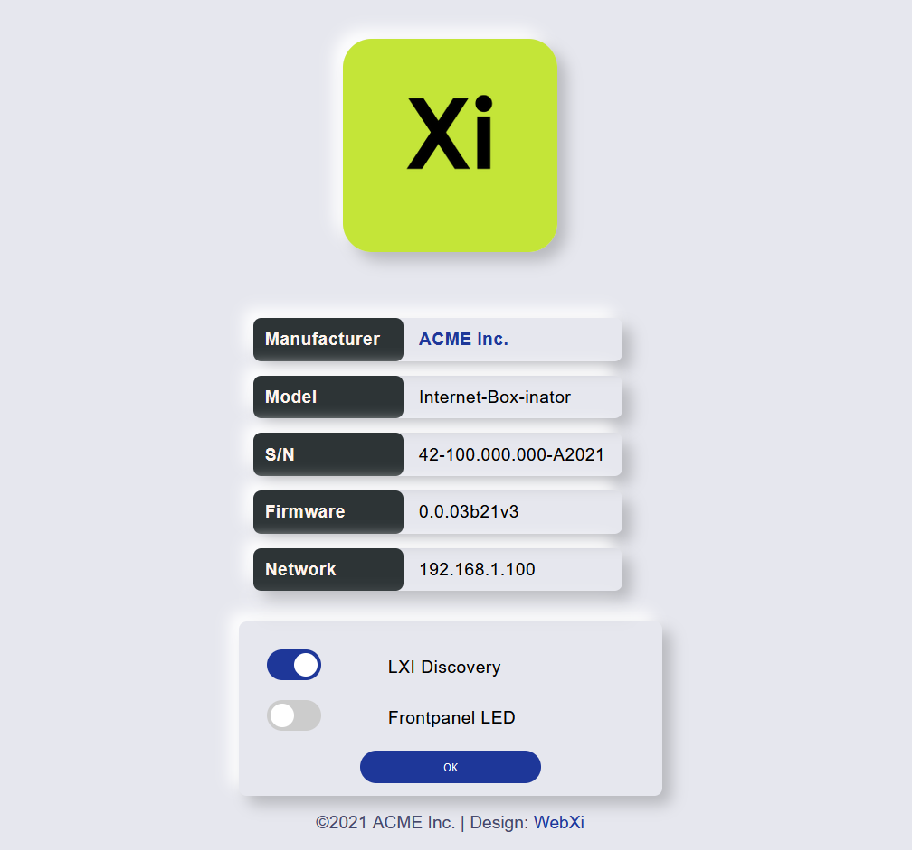
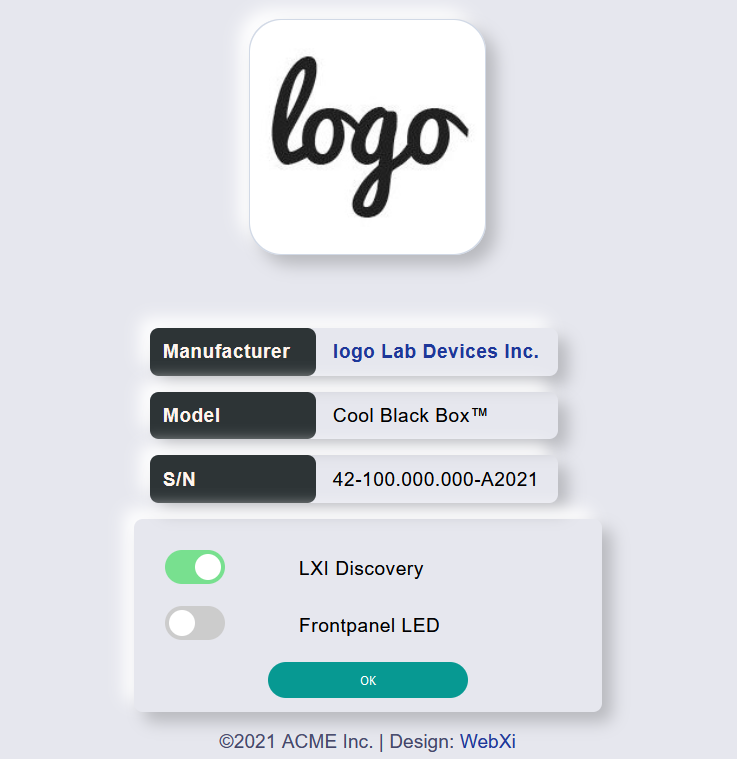
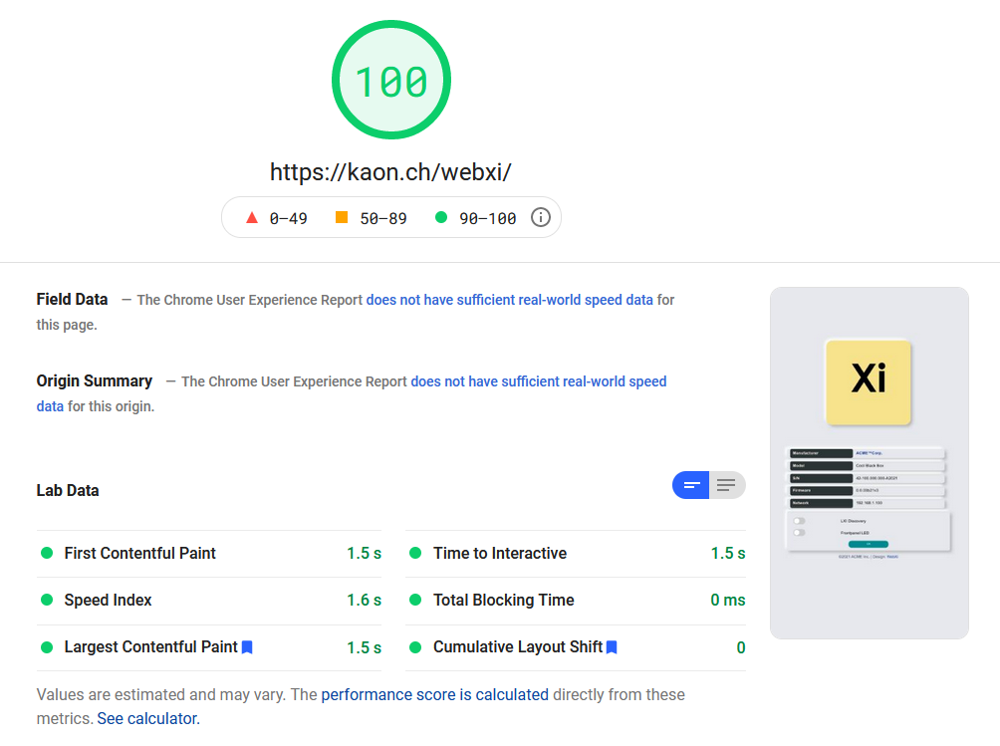

# webxi

WebXi is an **ultra lightweight**, fabulous looking website template with focus on **low file size** to run on the limited memory size of embedded microcontrollers.

---

### Preface

Embedded microcontrollers like the [`STM32F746zg`](https://www.st.com/en/microcontrollers-microprocessors/stm32f746zg.html) usually have around `1MB` of on board flash. Altough an embedded system design might incorporate additional external flash memory, it is still desirable to have very compact files to host for performance reasons.

#### Design Criteria

| description | requirement |
|:------------|:------------|
| memory usage of `index.html` | `< 5kB` |
| memory usage of `webxi.css` | `< 5kB` |
| JavaScript | no |

---

### Screenshots




---

### Metrics 



---

### Customization & Implementation 

- customize using a color palette [flatuicolors.com](https://flatuicolors.com/)
- use an [image compressor](https://compresspng.com/) for Logos
- use a [CSS minifier](https://cssminifier.com/) for the `webxi.css`
- use a [HTML minifier](https://kangax.github.io/html-minifier/)
- Tutorial for a CGI + SSI Website on STM32 [ausleuchtung.ch](http://ausleuchtung.ch/stm32-nucleo-f767zi-web-server/)

The minifiers achieve up to 50% smaller file size!

On the tutorial page you find a `makefsdata.pl` Perl script to transform the `fs` folder into `C` code reflecting the root path of the webserver.

```
opening root directory, found the following files and all subdirectories to process:
  404.shtml css img index.shtml

Processing directory css
  Adding files: webxi.css

Processing directory img
  Adding files: logo.png


Starting convert files to arrays process:
  Adding file: 404.shtml
  /404.shtml, Bytesread = 236

  Adding file: index.shtml
  /index.shtml, Bytesread = 1525

  Adding file: css/webxi.css
  /css/webxi.css, Bytesread = 1828

  Adding file: img/logo.png
  /img/logo.png, Bytesread = 1785
```

In total this example of a SSI enabled (dynamic) CGI Interface requires less than `6kB` of flash memory.

---

#### Disclaimer

> Do you miss something? Did you spot some webdesign specific bad practice?

Unfortunately, I am no webdesigner. I challenge you to create other ultra-lightweight themes for Embedded Systems :)

---

This Template is inspired by [Neumorphism UI](https://github.com/themesberg/neumorphism-ui-bootstrap) by [Themsberg](https://themesberg.com/).


